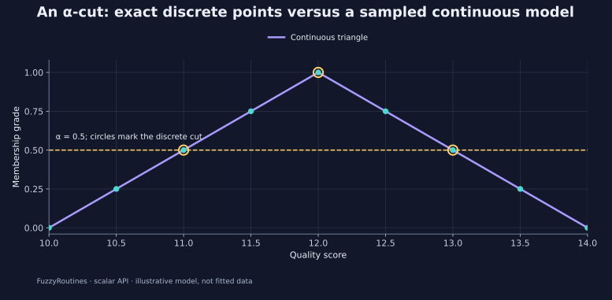

<!--
SPDX-FileCopyrightText: 2026 Timur Gilmullin and Fuzzy Technologies
SPDX-License-Identifier: Apache-2.0
-->

# Quality alpha cuts

**Question:** which declared quality scores meet a membership threshold of
0.5? A triangular tolerance model has full membership at 12 and zero at 10 and
14. The weak cut includes threshold equality.

```python
from fuzzyroutines import (
    AlphaCut, ContinuousUniverse, DeriveProperties, DiscreteUniverse,
    IntegrationDomain, SampleAlphaCut, ScalarFuzzySet, Triangle,
)

model = Triangle(10, 12, 14)
discrete = ScalarFuzzySet(DiscreteUniverse((10, 11, 12, 13, 14)), model)
assert AlphaCut(discrete, 0.5).points == (11, 12, 13)
assert AlphaCut(discrete, 0).points == (10, 11, 12, 13, 14)
assert AlphaCut(discrete, 1).points == (12,)
universe = ContinuousUniverse(10, 14, leftClosed=True, rightClosed=True)
continuous = ScalarFuzzySet(universe, model)
sampled = SampleAlphaCut(continuous, 0.5, IntegrationDomain(10, 14), sampleCount=9)
properties = DeriveProperties(model, universe)
assert sampled.cutSamples.points == (11, 11.5, 12, 12.5, 13)
assert not sampled.isExact and properties.isExact
assert not properties.positiveSupport.Contains(10)
assert properties.supportClosure.Contains(10)
assert properties.core.Contains(12)
print(sampled.cutSamples.points)
```



The exact **discrete** cut is $\{11,12,13\}$, because every coordinate of
the declared discrete universe is inspected. At alpha zero it includes all
declared points, even those with zero membership.

The continuous example samples nine coordinates at spacing 0.5. It reports
five qualifying observations and `isExact=False`; those observations are not
an exact continuous region. For this particular known triangle, solving the
two linear inequalities independently yields the continuous cut $[11,13]$.
`SampleAlphaCut` does not perform that symbolic solution.

`DeriveProperties` uses the known analytical family: positive support is
$(10,14)$, support closure is $[10,14]$, and the core is $\{12\}$.
Notice why positive support and its closure have different endpoints.

**Use in your project:** use an exact discrete cut for a finite catalogue of
allowed settings. Use a sampled result for exploration of a continuous model,
and retain its domain and grid count in the report. A denser grid increases
observations but does not prove unseen features absent.

```bash
python -I examples/guide.py --scenario alpha-cuts
```

Continue with [centroids and numerical accuracy](centroid.md).
