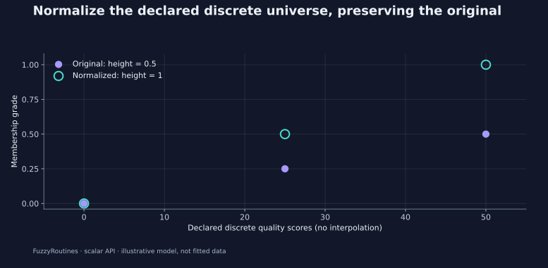

<!--
SPDX-FileCopyrightText: 2026 Timur Gilmullin and Fuzzy Technologies
SPDX-License-Identifier: Apache-2.0
-->

# A custom quality model

**Question:** can a domain-specific scalar function participate in integration
and finite-universe normalization without subclassing?

```python
from math import isclose
from fuzzyroutines import (
    Centroid, ComparisonPolicy, ContinuousUniverse, DiscreteUniverse,
    EqualOnDomain, Height, IncludedOnDomain, IntegrationDomain,
    MembershipScalar, Normalize, ScalarFuzzySet,
)


def RisingQuality(coordinate: MembershipScalar) -> MembershipScalar:
    """Map a declared score in [0, 100] to its linear membership grade."""

    return coordinate / 100


continuous = ScalarFuzzySet(
    ContinuousUniverse(0, 100, leftClosed=True, rightClosed=True), RisingQuality,
)
centroid = Centroid(continuous, IntegrationDomain(0, 100))
assert isclose(centroid, 200 / 3, abs_tol=1e-9)
discrete = ScalarFuzzySet(DiscreteUniverse((0, 25, 50)), RisingQuality)
normalized = Normalize(discrete)
assert Height(discrete) == 0.5 and Height(normalized) == 1
assert tuple(normalized.Membership(coordinate) for coordinate in discrete.universe.points) == (0, 0.5, 1)
policy = ComparisonPolicy("exact")
assert IncludedOnDomain(discrete, normalized, policy)
assert not EqualOnDomain(discrete, normalized, policy)
print(centroid, Height(discrete), Height(normalized))
```

The callable contract accepts one finite non-boolean real coordinate and
returns a finite grade in $[0,1]$. `MembershipScalar` expresses the broader
supported scalar input type. Construction checks callability; evaluation
checks the coordinate and returned grade. Keep grades consistent between calls;
the library does not snapshot an arbitrary function's captured mutable state.

The function $x/100$ has area 50 and first moment $10000/3$ over
$[0,100]$. Its centroid is therefore $200/3\approx66.666667$, matching
the adaptive calculation. The built-in analytical geometry machinery cannot
prove exact continuous height or support for an arbitrary callable. Sampling
can describe observations, but cannot supply such a proof.



On the discrete universe $\{0,25,50\}$, exhaustive evaluation proves a
height of 0.5. `Normalize` divides every grade by that height and returns a new
set; the original is unchanged. The figure deliberately draws only points:
the declared universe contains no intermediate coordinates.

Exact comparison establishes inclusion at **all three declared points**.
Continuous `EqualOnDomain` and `IncludedOnDomain` instead require an explicit
finite `ComparisonDomain`; they prove agreement only at those observations,
not equality or inclusion everywhere in an interval. A tolerance policy
requires explicit absolute and relative tolerances.

**Use in your project:** wrap a stable calibration function with a declared
universe, retain its units and validation assumptions, and verify independent
integrals for representative cases. Normalize only when the semantics of
rescaling the largest grade to one fit your application.

```bash
python -I examples/guide.py --scenario custom
```

Continue with the [membership gallery](membership-families.md) or
[complete API reference](../api/index.md).
