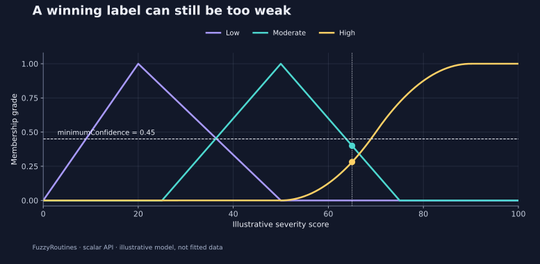

<!--
SPDX-FileCopyrightText: 2026 Timur Gilmullin and Fuzzy Technologies
SPDX-License-Identifier: Apache-2.0
-->

# Severity labels and abstention

**Question:** should a severity score of 65 receive a label when its strongest
grade is only 0.4? The score is an illustrative engineering index on 0–100,
not an event probability or a medically validated risk estimate.

```python
from math import isclose
from fuzzyroutines import (
    ContinuousUniverse, FuzzificationPolicy, LinguisticScale,
    LinguisticTerm, ScalarFuzzySet, SShoulder, Triangle,
)

universe = ContinuousUniverse(0, 100, leftClosed=True, rightClosed=True)
scale = LinguisticScale((
    LinguisticTerm("Low", ScalarFuzzySet(universe, Triangle(0, 20, 50))),
    LinguisticTerm("Moderate", ScalarFuzzySet(universe, Triangle(25, 50, 75))),
    LinguisticTerm("High", ScalarFuzzySet(universe, SShoulder(50, 90))),
))
result = scale.Fuzzify(65)
cautious = scale.Fuzzify(65, FuzzificationPolicy(minimumConfidence=0.45))
grades = {item.term.name: item.grade for item in result.memberships}
assert isclose(grades["Moderate"], 0.4)
assert grades["High"] == 0.28125
assert result.selectedTerms[0].name == "Moderate"
assert not cautious.isMatch
print(grades, cautious.isMatch)
```

[](../assets/figures/risk.svg)

The default result selects *Moderate*. Its descending triangle gives

$$
\mu_{\mathrm{Moderate}}(65)=\frac{75-65}{75-50}=0.4.
$$

The rising shoulder gives $2(15/40)^2=0.28125$ for *High*. *Low* is zero.
The `confidence` field is the maximum membership, not calibrated statistical
confidence. With `minimumConfidence=0.45`, selection abstains while preserving
the grades. A grade **equal to** the threshold also abstains; selection requires
strictly greater confidence.

**Use in your project:** route unmatched observations for review or a defined
fallback. Select the threshold from the application's requirements and validate
it against representative observations. FuzzyRoutines does not estimate or
validate that threshold for you.

```bash
python -I examples/guide.py --scenario risk
```

Continue with [combining sensor criteria](sensors.md).
