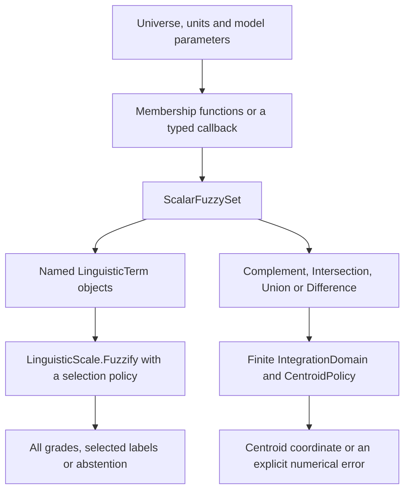
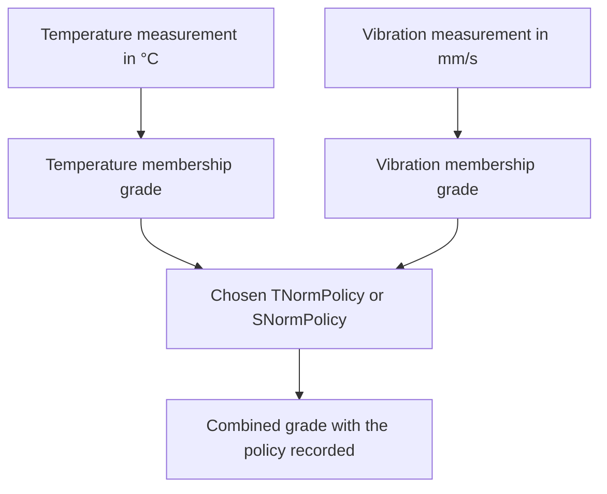
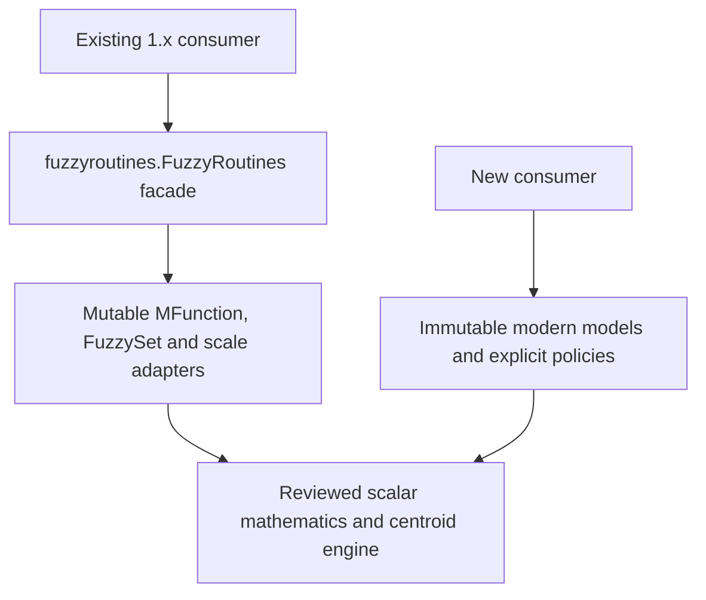

<!--
SPDX-FileCopyrightText: 2026 Timur Gilmullin and Fuzzy Technologies
SPDX-License-Identifier: Apache-2.0
-->

# From a model to an explained result

The library supplies explicit building blocks. Start with the physical meaning,
units and allowed universe, then choose membership models and the operation
that answers your question. It does not invent rules, calibrate thresholds or
choose a numerical backend automatically.

## Two routes through the modern API

The [temperature example](temperature.md) follows the classification branch:
one physical measurement is evaluated against every named term. The
[centroid example](centroid.md) follows the composition branch: sets share a
universe and produce one representative coordinate over a stated finite window.
These are different questions, even if both begin with the same model.

## Combine separate sensor measurements at the grade level

This is the [sensor scenario](sensors.md). Distinct physical quantities retain
their own universes. Evaluate them first, then combine their grades with an
explicit scalar policy. A set-level intersection instead evaluates sets at the
same coordinate on one shared universe. See [operator comparisons](operators.md).

## The historical boundary

The facade preserves reviewed names and call conventions. It retains a mutable
object model, later-wins ties and historical naming such as `supportSet` for an
integration window. Modern objects make universes, selection, comparison and
integration policies explicit. Read [historical recipes](historical-recipes.md)
before replacing an existing call; identical mathematical intent does not
guarantee identical parameter order or tie behavior.

The diagrams describe current scalar API paths. The optional NumPy prototype is
an experimental workload comparison, not an automatically selected runtime.
Use [result records](results.md) to preserve provenance and [error handling](errors.md)
to keep invalid input distinct from unresolved mathematics.
