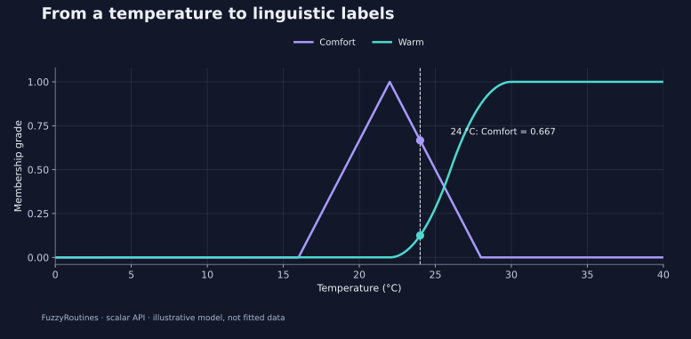

<!--
SPDX-FileCopyrightText: 2026 Timur Gilmullin and Fuzzy Technologies
SPDX-License-Identifier: Apache-2.0
-->

# Quick start

Turn a measured temperature into interpretable linguistic grades, then choose a
label. FuzzyRoutines provides scalar fuzzy sets, eight membership families,
explicit combination policies, linguistic scales, alpha cuts, and continuous
centroids. The modern API requires **CPython 3.13 or 3.14** and has no mandatory
NumPy or plotting dependency.

## Install

Create an isolated environment:

```bash
python -m venv .venv
# Linux/macOS:
source .venv/bin/activate
# Windows PowerShell: .venv\Scripts\Activate.ps1
python -m pip install --upgrade pip
```

**While 2.0 is in development**, install the modern code from `develop`:

```bash
python -m pip install "fuzzyroutines @ git+https://github.com/Fuzzy-Technologies/FuzzyRoutines.git@develop"
```

This command requires Git and follows a moving development branch. For a
reproducible experiment, replace `develop` with the full reviewed commit SHA.
The public modern API used here is available at
`bd239d2b0972a796c4084498676042bdb7016bed`.

**After stable 2.0.0 has been published through release CI**, the installation
command will be:

```bash
python -m pip install fuzzyroutines==2.0.0
```

An older 1.x PyPI installation does not provide this modern API. The command
above is the stable-release route, not evidence that publication has completed.

## Measure and classify in a few lines

Suppose a room is at 24 °C. We define an illustrative *Comfort* triangle with
full membership at 22 °C, declining to zero at 16 and 28 °C. *Warm* rises
smoothly from 22 to 30 °C. Choose these thresholds with the people who understand
your application; they are model assumptions, not parameters learned by the
library.

```python
from math import isclose
from fuzzyroutines import (
    ContinuousUniverse, LinguisticScale, LinguisticTerm,
    ScalarFuzzySet, SShoulder, Triangle,
)

universe = ContinuousUniverse(0, 40, leftClosed=True, rightClosed=True)
scale = LinguisticScale((
    LinguisticTerm("Comfort", ScalarFuzzySet(universe, Triangle(16, 22, 28))),
    LinguisticTerm("Warm", ScalarFuzzySet(universe, SShoulder(22, 30))),
))
result = scale.Fuzzify(24)
grades = {item.term.name: item.grade for item in result.memberships}
assert isclose(grades["Comfort"], 2 / 3)
assert grades["Warm"] == 0.125
assert result.selectedTerms[0].name == "Comfort"
print(grades, result.selectedTerms[0].name)
```

The result is `Comfort ≈ 0.667`, `Warm = 0.125`, and the selected label is
`Comfort`. A grade describes compatibility with a defined concept. It is
**not a probability**, and the grades need not sum to one. `Fuzzify` reports all
grades; selection follows an explicit policy, with the first strongest term
selected by default.



The curves show the model on the declared 0–40 °C universe. The dashed line is
the measurement, and the dots are the two computed grades. This two-label
example deliberately leaves some temperatures uncovered. Check coverage before
using it as a complete operational scale.

## Combine, inspect, and explain a result

Continue with the [eight worked scenarios](guides/index.md). They cover
physical measurements, policy choices, abstention, directed fuzzy difference,
alpha cuts, centroids, scale diagnosis, and custom models. Each includes
self-contained code, expected numbers, and a figure. The
[membership gallery](guides/membership-families.md) helps choose a curve.

The script
[`examples/guide.py`](https://github.com/Fuzzy-Technologies/FuzzyRoutines/blob/develop/examples/guide.py)
runs all eight scenarios and checks independent numerical expectations. From a
checkout with the package installed:

```bash
python -I examples/guide.py
python -I examples/guide.py --scenario centroid
```

You can copy a scenario into your project. Its scalar computations use only
FuzzyRoutines and the Python standard library; the checked-in SVGs require no
plotting package to view. To regenerate the figures from a checkout, install
`docs/requirements-plots.txt` and run `tools/generate_guide_figures.py` as
described in the [figure provenance guide](guides/figures.md).

For older `MFunction`, `FuzzySet`, and `FuzzyScale` code, start with the
[historical facade](api/legacy/index.md). Modern sets and policies are immutable;
the historical facade deliberately preserves its mutable compatibility contract.
