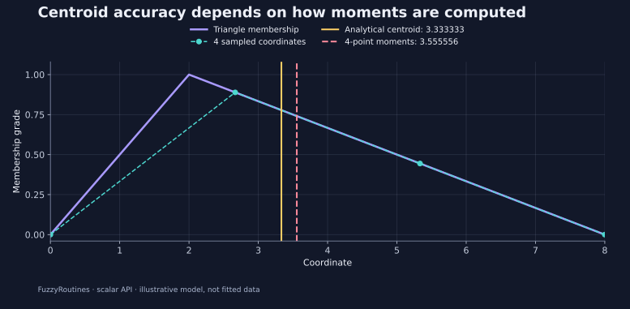

<!--
SPDX-FileCopyrightText: 2026 Timur Gilmullin and Fuzzy Technologies
SPDX-License-Identifier: Apache-2.0
-->

# Центроиды и численная точность {#centroids-and-numerical-accuracy}

**Вопрос:** как заменить непрерывный нечёткий профиль одной представительной координатой и независимо проверить полученное число?

Для конечной области интегрирования $[a,b]$ с положительной площадью под функцией принадлежности

$$
c=\frac{\int_a^b x\mu(x)\,\mathrm{d}x}{\int_a^b \mu(x)\,\mathrm{d}x}.
$$


```python
from math import isclose
from fuzzyroutines import (
    Centroid, ContinuousUniverse, IntegrationDomain,
    ScalarFuzzySet, SNormPolicy, Triangle, Union,
)

universe = ContinuousUniverse(0, 8, leftClosed=True, rightClosed=True)
triangle = ScalarFuzzySet(universe, Triangle(0, 2, 8))
centroid = Centroid(triangle, IntegrationDomain(0, 8))
assert isclose(centroid, (0 + 2 + 8) / 3, abs_tol=1e-12)

combinedUniverse = ContinuousUniverse(0, 10, leftClosed=True, rightClosed=True)
left = ScalarFuzzySet(combinedUniverse, Triangle(0, 1, 3))
right = ScalarFuzzySet(combinedUniverse, Triangle(4, 6, 10))
combined = Union(left, right, SNormPolicy("logic"))
combinedCentroid = Centroid(combined, IntegrationDomain(0, 10))
assert isclose(combinedCentroid, 44 / 9, abs_tol=1e-9, rel_tol=1e-9)
print(centroid, combinedCentroid)
```


Для первого треугольника геометрический центроид равен $(0+2+8)/3=10/3\approx3.333333$. Это независимый аналитический эталон. Для распознанного треугольного семейства библиотека использует аналитические моменты.

[](../../en/assets/figures/centroid.svg)

Голубая пунктирная линия соединяет четыре точки пользовательской выборки $0,8/3,16/3,8$ со степенями $0,8/9,4/9,0$. Раздельное применение метода трапеций к площади и первому моменту даёт

$$
A_4=\frac{32}{9},\qquad M_4=\frac{1024}{81},\qquad
c_4=\frac{M_4}{A_4}=\frac{32}{9}\approx3.555556.
$$


Абсолютное расхождение равно $c_4-c=2/9$, относительное — $(c_4-c)/c=1/15$, то есть около 6,67%. Исполняемый сценарий явно реализует этот расчёт. **Библиотечная функция `Centroid` не использует эту фиксированную сетку.** График показывает, как грубая выборка может изменить результат.

У двух непересекающихся треугольников площади равны $3/2$ и $3$, центроиды — $4/3$ и $20/3$. Поскольку их множества поддержки не пересекаются, объединение по максимуму складывает моменты площади без поправки на перекрытие:

$$
c=\frac{(3/2)(4/3)+3(20/3)}{3/2+3}=\frac{44}{9}\approx4.888889.
$$


Составная вызываемая функция интегрируется адаптивной квадратурой. Наблюдаемый результат совпадает с эталоном в пределах проверяемого допуска $10^{-9}$.

**Инженерные проверки:** область интегрирования должна лежать внутри непрерывного универсального множества. При нулевой площади возникает `UndefinedResultError`, при исчерпании глубины адаптации — `CentroidConvergenceError`; скрытого запасного результата нет. Допуски политики управляют интегрированием моментов и не являются доказанной абсолютной границей ошибки координаты центроида. Пользовательские функции должны быть достаточно регулярными: конечное число вычислений не исключает узких особенностей, пропущенных квадратурой. Учитывайте это при выборе области и модели.

**Применение в проекте:** сохраняйте единицы, конечные пределы интегрирования, политику и независимый эталон, если представительная координата влияет на решение. Усечение кривой меняет сам запрашиваемый центроид.

```bash
python -I examples/guide.py --scenario centroid
```


Далее — [аудит шкалы](scale-audit.md).
