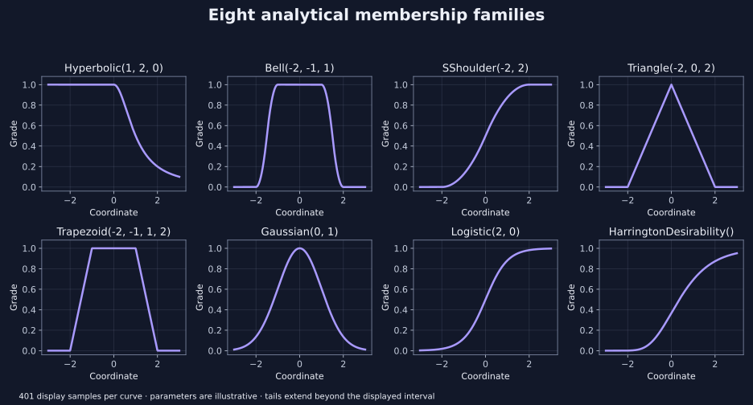

<!--
SPDX-FileCopyrightText: 2026 Timur Gilmullin and Fuzzy Technologies
SPDX-License-Identifier: Apache-2.0
-->

# Выбор семейства функций принадлежности {#choose-a-membership-family}

Выбирайте кривую по смыслу понятия: полоса допуска, плавный переход, предпочтение центрального значения или монотонный хвост. Фабрики возвращают неизменяемые объекты `MembershipFunction` и не подбирают параметры по данным. Все координаты и параметры должны удовлетворять описанным требованиям к конечным вещественным значениям. Логические значения не принимаются как числа.

[](../../en/assets/figures/membership-families.svg)

Каждая кривая отображает 401 наблюдение от −3 до 3. Показанный интервал не определяет математическое множество поддержки. Гауссовы, логистические, гиперболические хвосты и хвосты функции желательности продолжаются за его пределами. Численное обращение в ноль при далёкой координате не меняет аналитическое множество поддержки семейства.

## Hyperbolic: насыщение с убывающим хвостом {#hyperbolic-saturation-followed-by-a-decreasing-tail}

`Hyperbolic(scale, exponent, cutoff)` равна единице при координатах не выше `cutoff` и убывает после него. Положительные масштаб и показатель определяют хвост. Для иллюстративного штрафа можно взять `Hyperbolic(1, 2, 0)`; при координате 1 степень равна 0.5.

## Bell: гладкая конечная полоса допуска {#bell-a-smooth-finite-tolerance-band}

`Bell(left, plateauStart, plateauEnd)` имеет квадратичные плечи и плоское плато. Правая опорная точка равна `plateauEnd + plateauStart - left`; это не гауссова функция. У `Bell(-2, -1, 1)` плато занимает [−1, 1], правая опорная точка равна 2.

## SShoulder: плавный переход к насыщению {#s-shoulder-a-smooth-transition-to-saturation}

`SShoulder(left, right)` равна нулю при координатах не выше `left`, единице — не ниже `right`; между ними переход квадратичный. В середине степень равна 0.5. Используйте её, когда растущая величина постепенно достигает полного соответствия понятию.

## Triangle: предпочтительное значение с линейным допуском {#triangle-a-preferred-value-with-linear-tolerance}

`Triangle(left, peak, right)` использует обычный порядок: левая граница, вершина, правая граница. Требуется `left < peak <= right`; вершина на правой границе допустима. Симметричный треугольник удобен для предпочтительной настройки, но асимметричные допуски тоже допустимы. Сценарий качества использует `Triangle(10, 12, 14)`.

## Trapezoid: полностью приемлемый интервал {#trapezoid-a-fully-acceptable-interval}

`Trapezoid(left, plateauStart, plateauEnd, right)` имеет линейные плечи и интервал единичной принадлежности. Равенство `plateauStart == plateauEnd` допустимо. Используйте её, когда одинаково приемлем диапазон настроек, а не одна предпочтительная точка.

## Gaussian: гладкое предпочтение вокруг центра {#gaussian-smooth-preference-around-a-center}

`Gaussian(center, scale)` вычисляет ненормированную кривую принадлежности

$$
\mu(x)=\exp\left[-\frac12\left(\frac{x-\mathrm{center}}{\mathrm{scale}}\right)^2\right].
$$


Масштаб положителен, значение в вершине равно единице. Это функция принадлежности, а не нормированная плотность вероятности; её площадь не обязана равняться единице.

## Logistic: монотонная сигмоида {#logistic-a-monotone-sigmoid}

`Logistic(slope, midpoint)` имеет степень 0.5 в средней точке. Наклон должен быть ненулевым: положительный задаёт рост, отрицательный — убывание. Ни одна конечная координата математически не достигает предельных степеней ноль или один, хотя вычисление с плавающей точкой может округлиться до границы или обратиться в ноль из-за потери представимости.

## HarringtonDesirability: фиксированная асимметричная сигмоида {#harrington-desirability-a-fixed-asymmetric-sigmoid}

`HarringtonDesirability()` не имеет параметров и вычисляет

$$
\mu(x)=\exp[-\exp(-x)].
$$


На вход подаётся безразмерная преобразованная координата желательности. Прежде чем передавать физическое измерение, определите такое преобразование в своей модели. При нуле степень равна $\exp(-1)$, приблизительно 0.367879.

## Вычисление всех семейств и просмотр неизменяемого определения {#execute-every-family-and-inspect-an-immutable-definition}

```python
from math import exp, isclose
from fuzzyroutines import (
    Bell, Gaussian, HarringtonDesirability, Hyperbolic, Logistic,
    MembershipFunction, SShoulder, Trapezoid, Triangle,
)

assert Hyperbolic(1, 2, 0)(1) == 0.5
assert Bell(-2, -1, 1)(0) == 1
assert SShoulder(-2, 2)(0) == 0.5
assert Triangle(-2, 0, 2)(0) == 1
assert Trapezoid(-2, -1, 1, 2)(0) == 1
assert Gaussian(0, 1)(0) == 1
assert Logistic(2, 0)(0) == 0.5
assert isclose(HarringtonDesirability()(0), exp(-1))
definition = MembershipFunction("triangle", left=-2, peak=0, right=2)
assert definition.Evaluate(0) == definition(0) == 1
assert definition.family == "triangle" and definition.parameters["peak"] == 0
print(definition.family, dict(definition.parameters))
```


Фабричные функции — самый простой способ начать. Общий конструктор требует точных канонических идентификаторов семейств и имён параметров, в том числе `"s_shoulder"` и `"harrington_desirability"`. Эти строковые значения — данные, а не имена объявлений Python. Все ограничения приведены в [API функций принадлежности](../api/modern/membership.md).

Если эти семейства не выражают нужную модель, используйте [типизированную пользовательскую функцию](custom.md). Точные непрерывные свойства требуют аналитического обоснования; сходства произвольной кривой с известной формой для этого недостаточно.
