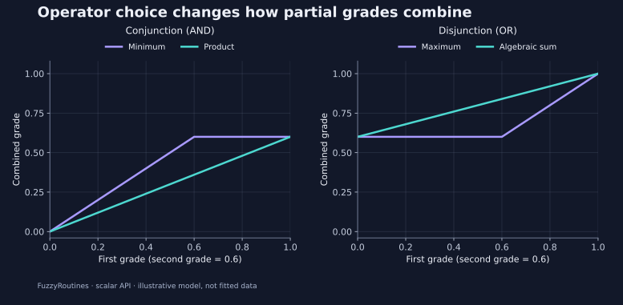

<!--
SPDX-FileCopyrightText: 2026 Timur Gilmullin and Fuzzy Technologies
SPDX-License-Identifier: Apache-2.0
-->

# Выбор правил объединения степеней {#choose-how-grades-combine}

**Вопрос:** должны ли два частично выполненных критерия давать меньшую степень или их частичное выполнение должно перемножаться? Это выбор политики модели. Сначала оцените каждую физическую величину собственной функцией принадлежности, затем объедините безразмерные степени. При композиции множеств оба должны иметь одно универсальное множество.

Для двух степеней $a,b\in[0,1]$ изображены следующие политики:

$$
T_{\mathrm{minimum}}(a,b)=\min(a,b),\qquad
T_{\mathrm{product}}(a,b)=ab,
$$


$$
S_{\mathrm{maximum}}(a,b)=\max(a,b),\qquad
S_{\mathrm{algebraic}}(a,b)=a+b-ab.
$$


[](../../en/assets/figures/operators.svg)

По горизонтали первая степень меняется от нуля до единицы, вторая фиксирована на 0.6. Слева минимум насыщается на 0.6, а произведение умножает первую степень на 0.6. Справа максимум не опускается ниже 0.6, а алгебраическая дизъюнкция непрерывно растёт до единицы. Это явные нечёткие политики, а не предположение о статистической независимости измерений.

```python
from math import isclose
from fuzzyroutines import NegationPolicy, SNormPolicy, TNormPolicy

first, second = 0.4, 0.6
assert TNormPolicy("logic").Evaluate(first, second) == 0.4
assert isclose(TNormPolicy("algebraic").Evaluate(first, second), 0.24)
assert SNormPolicy("logic").Evaluate(first, second) == 0.6
assert isclose(SNormPolicy("algebraic").Evaluate(first, second), 0.76)
assert NegationPolicy("standard").Evaluate(first) == 0.6
print(0.4, 0.24, 0.6, 0.76)
```


Стандартное отрицание: $N(a)=1-a$. Направленная разность использует конъюнкцию с отрицанием второй степени: для минимума $\mu_{A\setminus B}(x)=\min(\mu_A(x),1-\mu_B(x))$. Это не обычное вычитание. [Сценарий предупреждения](alarm.md) показывает итоговую кривую. Исполняемые примеры граничной и радикальной альтернатив, параметрического и параболического отрицаний приведены в [рецептах API](api-recipes.md#choose-scalar-operator-families-deliberately).

**Применение в проекте:** сохраняйте выбранную политику с моделью и сравнивайте промежуточные степени до её смены. Произведение может существенно уменьшить результат AND; это не означает меньшую скорость или точность реализации. Выбор выражает способ объединения частичного соответствия.
