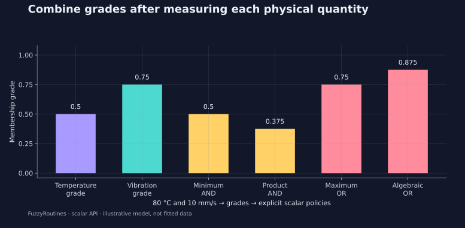

<!--
SPDX-FileCopyrightText: 2026 Timur Gilmullin and Fuzzy Technologies
SPDX-License-Identifier: Apache-2.0
-->

# Объединение двух критериев датчиков {#combine-two-sensor-criteria}

**Вопрос:** насколько температура 80 °C и вибрация 10 мм/с удовлетворяют двум иллюстративным критериям предупреждения? Перед объединением преобразуйте каждое физическое измерение в собственную безразмерную степень принадлежности. Модель не вычисляет вероятность отказа.

```python
from fuzzyroutines import SNormPolicy, SShoulder, TNormPolicy, Triangle

temperatureGrade = SShoulder(60, 100)(80)
vibrationGrade = Triangle(0, 8, 16)(10)
minimumAnd = TNormPolicy("logic").Evaluate(temperatureGrade, vibrationGrade)
productAnd = TNormPolicy("algebraic").Evaluate(temperatureGrade, vibrationGrade)
maximumOr = SNormPolicy("logic").Evaluate(temperatureGrade, vibrationGrade)
algebraicOr = SNormPolicy("algebraic").Evaluate(temperatureGrade, vibrationGrade)
assert (temperatureGrade, vibrationGrade) == (0.5, 0.75)
assert (minimumAnd, productAnd, maximumOr, algebraicOr) == (0.5, 0.375, 0.75, 0.875)
print(minimumAnd, productAnd, maximumOr, algebraicOr)
```


[](../../en/assets/figures/sensors.svg)

Конъюнкция по минимуму сохраняет меньшую степень: $\min(0.5,0.75)=0.5$. Конъюнкция по произведению даёт $0.5\times0.75=0.375$. Дизъюнкция по максимуму равна 0.75, а алгебраическая дизъюнкция равна

$$
0.5+0.75-0.5\times0.75=0.875.
$$


Это разные нечёткие операторы, а не режимы производительности. Применение T-нормы произведения не устанавливает вероятностную независимость.

**Инженерная проверка:** измерения имеют разные единицы и универсальные множества, поэтому здесь нужен `Evaluate` скалярной политики. Операции над множествами `Intersection` и `Union` требуют общего универсального множества. Полная база правил «температура–вибрация» потребовала бы явно заданного многомерного механизма вывода; в этом примере он не реализован.

**Применение в проекте:** сохраняйте выбранную политику вместе с порогами критериев. Четыре значения показывают, почему смена политики может изменить последующее решение при тех же измерениях.

```bash
python -I examples/guide.py --scenario sensors
```


Далее — [зоны предупреждения для обслуживания](alarm.md).
