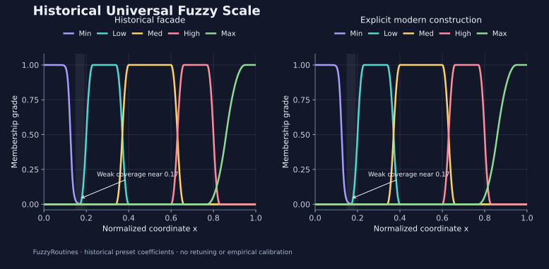

<!--
SPDX-FileCopyrightText: 2026 Timur Gilmullin and Fuzzy Technologies
SPDX-License-Identifier: Apache-2.0
-->

# Историческая универсальная нечёткая шкала

**Universal Fuzzy Scale — универсальная нечёткая шкала** — историческая модель
FuzzyRoutines с пятью уровнями: **Min → Low → Med → High → Max**
(минимальный, низкий, средний, высокий, максимальный). Ниже сохранены её исходные
коэффициенты и показано, как собрать тот же классификатор через современный API.
«Универсальная» — историческое название, а не доказательство пригодности для
любой задачи. Это не трёхуровневая шкала `FuzzyScale` по умолчанию и не пять
равномерно расположенных треугольников.

[](../../en/assets/figures/universal-fuzzy-scale.svg)

Слева показаны вычисления исторического API, справа — современного. Min резко убывает около
0,125; Low, Med и High имеют плоские вершины и квадратичные склоны; Max возрастает
между 0,77 и 0,95. Малый положительный хвост Min сохраняется, хотя на графике его
почти не видно.

## Уровни риска и защищённости

Шкалу можно использовать в кибербезопасности и оценке рисков, чтобы переводить
нормированную числовую оценку в словесный уровень: например, оценивать риск для
актива, серьёзность выявленной проблемы безопасности или эффективность мер
защиты. Сначала определите, как наблюдения или экспертные оценки преобразуются
в число из `[0, 1]` и что означает его рост. Повышение риска и усиление защиты
имеют противоположный смысл для принятия решений, хотя в обоих случаях можно
использовать уровни Min, Low, Med, High и Max.

Например, для условной оценки риска `0.75` историческая шкала выбирает `High`
со степенью принадлежности `1`. Это полная принадлежность уровню High в данной
модели; ни одно из этих чисел не является вероятностью инцидента. Вместе с
выбранным уровнем сохраняйте степени принадлежности, чтобы видеть переходы
между уровнями. Правила нормирования, объединения оценок и реагирования задаются
для конкретной задачи и проверяются на предметных данных; область слабого
покрытия нужно обрабатывать явно, как показано ниже. Шкала даёт словесную
интерпретацию входной оценки, но сама по себе не измеряет риск и не определяет
порядок реагирования на инциденты.

## Исходные параметры

| Уровень | Историческое семейство / современный конструктор | Исторический `supportSet` |
| ------- | ------------------------------------------------ | ------------------------- |
| Min     | `hyperbolic` / `Hyperbolic(8, 20, 0)`            | `[0, 0.23]`               |
| Low     | `bell` / `Bell(0.17, 0.23, 0.34)`                | `[0.17, 0.40]`            |
| Med     | `bell` / `Bell(0.34, 0.40, 0.60)`                | `[0.34, 0.66]`            |
| High    | `bell` / `Bell(0.60, 0.66, 0.77)`                | `[0.60, 0.83]`            |
| Max     | `parabolic` / `SShoulder(0.77, 0.95)`            | `[0.77, 1]`               |

`supportSet` здесь — **исторический конечный интервал интегрирования для центра
тяжести**. Метод `UniversalFuzzyScale.Fuzzy(x)` вызывает `mFunction.mju(x)` и
**не обрезает** функцию по этому интервалу. Например, Min положителен и после
0,23. Поэтому современная модель использует общее замкнутое универсальное
множество `[0, 1]` для всех пяти термов. Подстановка пяти `supportSet` вместо
общего универсального множества изменит контракт и приведёт к ошибкам при
классификации большинства координат.

При $0\le x\le1$ формулы можно записать через возрастающую квадратичную функцию:

$$
s_{a,b}(x)=\begin{cases}
0,&x\le a,\\
2\left(\frac{x-a}{b-a}\right)^2,&a\lt x\le\frac{a+b}{2},\\
1-2\left(\frac{b-x}{b-a}\right)^2,&\frac{a+b}{2}\lt x\lt b,\\
1,&x\ge b.
\end{cases}
$$

$$
\mu_{\mathrm{Min}}(x)=\frac{1}{1+(8x)^{20}}
$$

$$
\mu_{\mathrm{Bell}(a,b,c)}(x)=\min\left\lbrace s_{a,b}(x),1-s_{c,c+b-a}(x)\right\rbrace
$$

$$
\mu_{\mathrm{Max}}(x)=s_{0.77,0.95}(x).
$$

Правая граница колоколообразной функции — $c+b-a$, её ядро — весь отрезок
$[b,c]$. Сумма степеней принадлежности не обязана равняться единице: это не
вероятности. Эти формулы служат независимой проверкой примера и графиков.

## Как использовать исторический API

```python
from math import isclose
from fuzzyroutines.FuzzyRoutines import UniversalFuzzyScale

scale = UniversalFuzzyScale()
assert [level["name"] for level in scale.levels] == ["Min", "Low", "Med", "High", "Max"]
grades = {level["name"]: level["fSet"].mFunction.mju(0.2) for level in scale.levels}
assert isclose(grades["Low"], 0.5)
assert scale.Fuzzy(0.2)["name"] == "Low"
assert scale.GetLevelByName("Med")["fSet"].supportSet == (0.34, 0.66)
assert scale.GetLevelByName("Min")["fSet"].mFunction.mju(0.5) > 0
print(grades, scale.Fuzzy(0.2)["name"])
```

Фасад совместимости сохраняет прежние имена и конструктор. Пример выполняется
на версии 2.0; это не обещание сохранить ошибки вычислений версии 1.0.3.
Исправления центра тяжести описаны в
[руководстве по миграции](https://github.com/Fuzzy-Technologies/FuzzyRoutines/blob/develop/docs/migration/1.0.3-to-2.0.0.md).

## Как создать шкалу через современный API

```python
from math import isclose
from fuzzyroutines import (
    Bell, ContinuousUniverse, FuzzificationPolicy, Hyperbolic,
    LinguisticScale, LinguisticTerm, ScalarFuzzySet, SShoulder,
)
from fuzzyroutines.FuzzyRoutines import UniversalFuzzyScale

universe = ContinuousUniverse(0, 1, leftClosed=True, rightClosed=True)
models = (
    ("Min", Hyperbolic(8, 20, 0)),
    ("Low", Bell(0.17, 0.23, 0.34)),
    ("Med", Bell(0.34, 0.40, 0.60)),
    ("High", Bell(0.60, 0.66, 0.77)),
    ("Max", SShoulder(0.77, 0.95)),
)
scale = LinguisticScale(tuple(
    LinguisticTerm(name, ScalarFuzzySet(universe, model))
    for name, model in models
))
legacy = UniversalFuzzyScale()
policy = FuzzificationPolicy(tiePolicy="last", tieTolerance=0)
for coordinate in (0, 0.125, 0.17, 0.2, 0.37, 0.5, 0.63, 0.81, 0.86, 1):
    result = scale.Fuzzify(coordinate, policy)
    for item, previous in zip(result.memberships, legacy.levels, strict=True):
        assert isclose(item.grade, previous["fSet"].mFunction.mju(coordinate), abs_tol=1e-12)
    assert result.selectedTerms[0].name == legacy.Fuzzy(coordinate)["name"]
assert isclose(scale.Fuzzify(0.125).confidence, 0.5)
assert not scale.Fuzzify(0.17, FuzzificationPolicy(minimumConfidence=0.1)).isMatch
assert not scale.Fuzzify(0.125, FuzzificationPolicy(minimumConfidence=0.5)).isMatch
print([(item.term.name, item.grade) for item in scale.Fuzzify(0.2).memberships])
```

Историческая функция `parabolic` соответствует `SShoulder`, а не неограниченной
параболе. Порядок термов и `tiePolicy="last"` сохраняют выбор последнего уровня
при точном равенстве максимальных степеней принадлежности. Современная политика
по умолчанию выбирает первый: при миграции это различие нужно указать явно.

## Числа и важные граничные случаи

| Координата | Результат / степень принадлежности             |
| ---------- | ---------------------------------------------- |
| 0          | Min = 1; левая граница включена                |
| 0,125      | Min = 0,5                                      |
| 0,17       | Min ≈ 0,002129589894; Low = 0: слабое покрытие |
| 0,20       | Low = 0,5; Min ≈ 0,000082711220                |
| 0,50       | Med = 1; Min ≈ 9,094947018 × 10⁻¹³             |
| 0,81       | High ≈ 2/9, Max ≈ 8/81; выбран High            |
| 0,86       | Max ≈ 0,5                                      |
| 1          | Max = 1; правая граница включена               |

Слабое покрытие между Min и Low — свойство исторических коэффициентов. Мы его
показываем, сохраняя исходную модель. В точке 0,17 прежний классификатор выбирает
Min, а современная политика с `minimumConfidence=0.1` возвращает отсутствие
совпадения. Максимум, **равный** порогу, тоже не проходит: условие строгое.
Этот порог задаёт требуемую степень принадлежности, а не вероятность ошибки.

В точной арифметике соседние колоколообразные функции равны при 0,37 и 0,63.
Однако при 0,37 вычисления с плавающей точкой дают Low ≈ 0,5000000000000009 и
Med ≈ 0,4999999999999991, поэтому исторический результат — **Low**.
`tieTolerance=0` сохраняет точное сравнение; положительный допуск намеренно
меняет обработку почти равных значений.

Современный пример отклоняет координаты вне `[0,1]`. Исторический API принимает
и другие конечные числа: −0,1 даёт Min, а 1,1 — Max. Физические величины нужно
явно проверять и нормировать. Для воспроизведения исторических центров тяжести
нужны прежние интервалы интегрирования каждого уровня, а не общий `[0,1]`.

## Воспроизведение

```bash
python examples/guide.py --scenario universal-fuzzy-scale
```

Пример проверяет обе реализации по независимым формулам на **1001 точке**
`0, 0.001, …, 1`, сравнивает выбранные уровни, отказ по порогу и хвост Min.
Проверки графиков независимо сверяют **401 точку каждой из десяти кривых**.
Конечная сетка — свидетельство регрессии, а не доказательство для всех
вещественных чисел. Подробнее:
[создание графиков](figures.md) и
[исторические параметры](https://github.com/Fuzzy-Technologies/FuzzyRoutines/blob/develop/docs/baseline/universal-fuzzy-scale-provenance.md).
