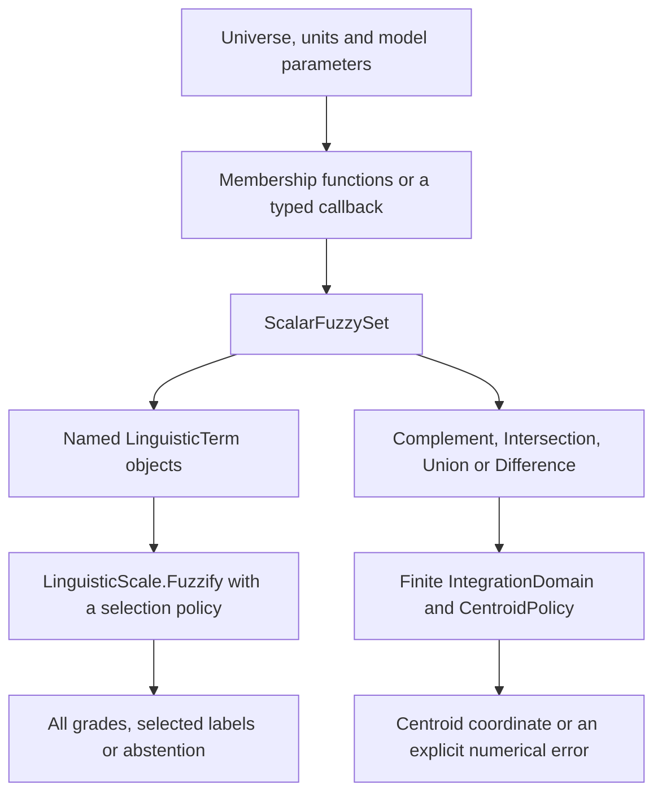
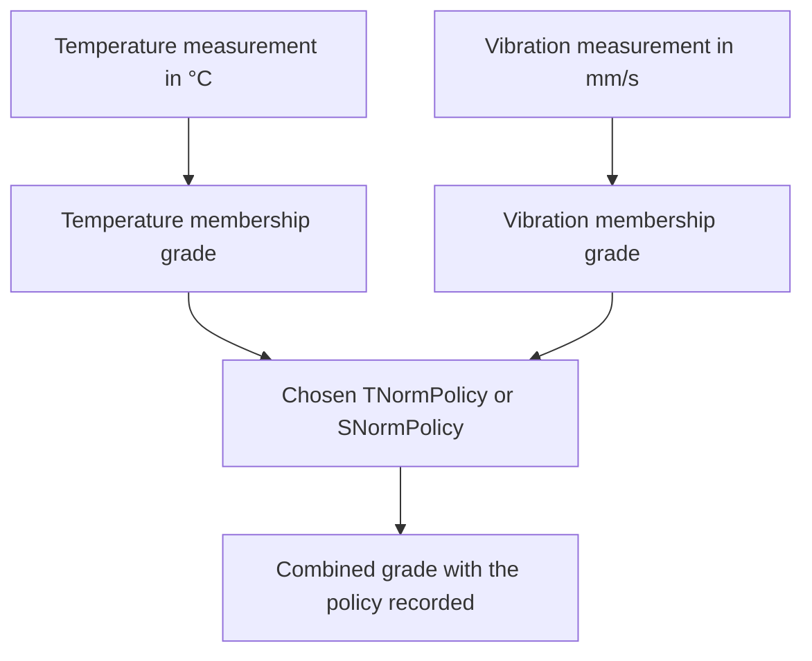
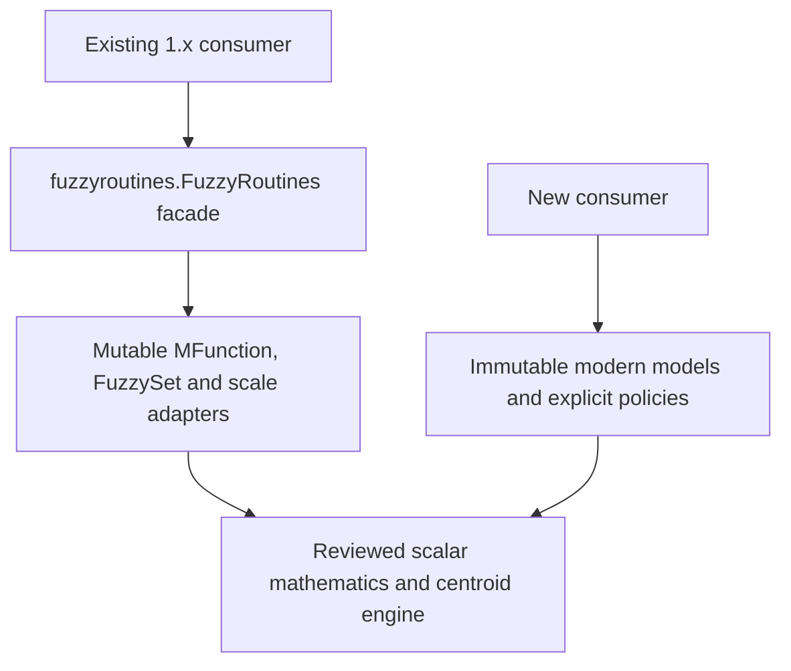

<!--
SPDX-FileCopyrightText: 2026 Timur Gilmullin and Fuzzy Technologies
SPDX-License-Identifier: Apache-2.0
-->

# От модели к объяснённому результату {#from-a-model-to-an-explained-result}

Библиотека предоставляет явные строительные блоки. Начните с физического смысла, единиц и допустимого универсального множества, затем выберите модели принадлежности и операцию, отвечающую на ваш вопрос. Библиотека не придумывает правила, не калибрует пороги и не выбирает вычислительное ядро автоматически.

## Два пути современного API {#two-routes-through-the-modern-api}

[Температурный пример](temperature.md) следует ветви классификации: одно физическое измерение оценивается относительно каждого именованного терма. [Пример центроида](centroid.md) следует ветви композиции: множества на общем универсальном множестве дают представительную координату в заданном конечном окне. Это разные вопросы, даже если исходная модель совпадает.

## Объединение отдельных измерений датчиков на уровне степеней {#combine-separate-sensor-measurements-at-the-grade-level}

Это [сценарий датчиков](sensors.md). Разные физические величины сохраняют собственные универсальные множества. Сначала вычислите степени, затем объедините их явной скалярной политикой. Пересечение на уровне множеств, напротив, оценивает множества в одной координате общего универсального множества. См. [сравнение операторов](operators.md).

## Граница исторического API {#the-historical-boundary}

Фасад сохраняет проверенные имена и соглашения вызовов. Он оставляет изменяемую модель объектов, выбор последнего терма при равенстве максимумов и исторические имена вроде `supportSet` для окна интегрирования. Современные объекты явно задают универсальные множества и политики выбора, сравнения и интегрирования. Перед заменой существующего вызова прочитайте [исторические рецепты](historical-recipes.md): одинаковый математический замысел не гарантирует одинакового порядка параметров или обработки равных максимумов.

Схемы описывают текущие пути скалярного API. Необязательный прототип NumPy — экспериментальное сравнение нагрузок, а не автоматически выбираемая среда исполнения. [Записи результатов](results.md) сохраняют происхождение данных, а [обработка ошибок](errors.md) помогает отличать недопустимый ввод от неразрешённой математической задачи.
