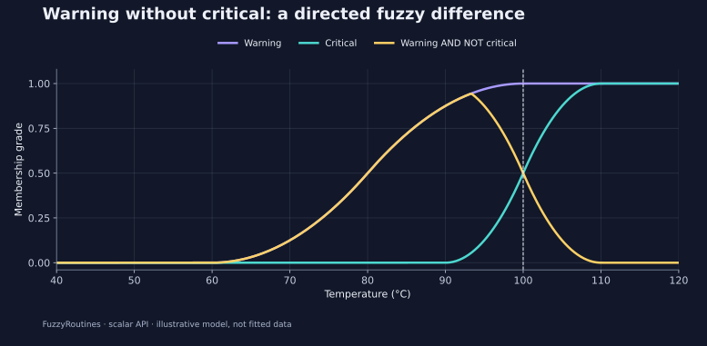

<!--
SPDX-FileCopyrightText: 2026 Timur Gilmullin and Fuzzy Technologies
SPDX-License-Identifier: Apache-2.0
-->

# 维护预警区域 {#maintenance-warning-zones}

**问题：**一个温度在多大程度上处于预警区域、同时又不属于临界区域？两个模型描述同一个 40–120 °C 论域，因此可以作为模糊集进行组合。

```python
from fuzzyroutines import (
    Complement, ContinuousUniverse, Difference, Intersection, NegationPolicy,
    ScalarFuzzySet, SNormPolicy, SShoulder, TNormPolicy, Union,
)

universe = ContinuousUniverse(40, 120, leftClosed=True, rightClosed=True)
warning = ScalarFuzzySet(universe, SShoulder(60, 100))
critical = ScalarFuzzySet(universe, SShoulder(90, 110))
negation = NegationPolicy("standard")
conjunction = TNormPolicy("logic")
warningWithoutCritical = Difference(warning, critical, conjunction, negation)
noncritical = Complement(critical, negation)
both = Intersection(warning, critical, conjunction)
either = Union(warning, critical, SNormPolicy("logic"))
assert warning.Membership(100) == 1
assert critical.Membership(100) == 0.5
assert warningWithoutCritical.Membership(100) == 0.5
assert noncritical.Membership(100) == both.Membership(100) == 0.5
assert either.Membership(100) == 1
print(warningWithoutCritical.Membership(100))
```


[](../../en/assets/figures/alarm.svg)

采用标准否定和最小值合取时，

$$
\mu_{W\setminus C}(x)=\min\{\mu_W(x),1-\mu_C(x)\}.
$$


在 100 °C 时，结果为 $\min(1,1-0.5)=0.5$。这种差运算是**有向的**：交换预警与临界区域会改变含义。它不是普通减法，也不是模糊数算术。当临界隶属度达到一时，组合结果降为零。

**项目用法：**除组合结果外，还应保留预警和临界隶属度，使仪表板能够解释决策。在实际使用这些演示阈值之前，需要针对具体应用进行验证。

```bash
python -I examples/guide.py --scenario alarm
```


继续阅读[质量 α-截集](alpha-cuts.md)。
