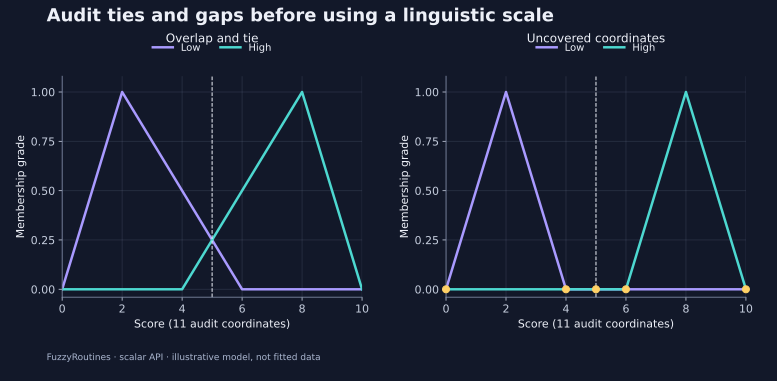

<!--
SPDX-FileCopyrightText: 2026 Timur Gilmullin and Fuzzy Technologies
SPDX-License-Identifier: Apache-2.0
-->

# 审查语言尺度 {#audit-a-linguistic-scale}

**问题：**尺度是否会产生并列最大值、弱匹配或覆盖空缺？在选择实际标签策略前，先诊断尺度设计。

```python
from fuzzyroutines import (
    ContinuousUniverse, FuzzificationPolicy, IntegrationDomain, LinguisticScale,
    LinguisticTerm, ScalarFuzzySet, ScaleDiagnosticsPolicy, Triangle,
)

universe = ContinuousUniverse(0, 10, leftClosed=True, rightClosed=True)
scale = LinguisticScale((
    LinguisticTerm("Low", ScalarFuzzySet(universe, Triangle(0, 2, 6))),
    LinguisticTerm("High", ScalarFuzzySet(universe, Triangle(4, 8, 10))),
))
tied = scale.Fuzzify(5, FuzzificationPolicy(tiePolicy="all"))
assert tied.isTie and tied.confidence == 0.25
assert tuple(term.name for term in tied.selectedTerms) == ("Low", "High")
assert scale.Fuzzify(5).selectedTerms[0].name == "Low"
assert not scale.Fuzzify(5, FuzzificationPolicy(minimumConfidence=0.3)).isMatch

gappyScale = LinguisticScale((
    LinguisticTerm("Low", ScalarFuzzySet(universe, Triangle(0, 2, 4))),
    LinguisticTerm("High", ScalarFuzzySet(universe, Triangle(6, 8, 10))),
))
audit = gappyScale.Diagnose(IntegrationDomain(0, 10), ScaleDiagnosticsPolicy(sampleCount=11))
assert tuple(point.coordinate for point in audit.gapPoints) == (0, 4, 5, 6, 10)
assert audit.gapFraction == 5 / 11
assert not gappyScale.Fuzzify(5).isMatch
print(audit.gapFraction, audit.maximumPartitionError)
```


[](../../en/assets/figures/scale-audit.svg)

评分为 5 时，第一个尺度产生两个 0.25 的隶属度。`tiePolicy="all"` 保留两个词项。默认的首词项策略选择 *Low*；`"last"` 则会选择 *High*。最小置信阈值 0.3 会拒绝这个较弱的并列结果。因此，词项顺序是 first/last 策略模型约定的一部分。

第二个尺度在十一处检查坐标中的五处，对两个词项都给出零隶属度：0、4、5、6 和 10。因此，**采样**空缺比例为 $5/11\approx0.454545$。这是已检查坐标的比例，并不是区间长度的连续比例。该网格将端点计入统计。

默认隶属度阈值为零：隶属度必须严格为正才算活跃。`membershipThreshold` 改变这一判定标准，不改变模型本身。分割误差衡量隶属度之和偏离一的程度，并不是相对于带标签观测的准确性误差。这些示例有意不构成单位分解。

**项目用法：**不仅要看汇总比例，还要检查各诊断点。除均匀网格外，也应检查已知过渡边界和物理上有意义的工况。网格诊断不能确立全局连续覆盖，也不能排除观测点之间的狭窄空缺。

```bash
python -I examples/guide.py --scenario scale-audit
```


继续阅读[自定义质量模型](custom.md)。
