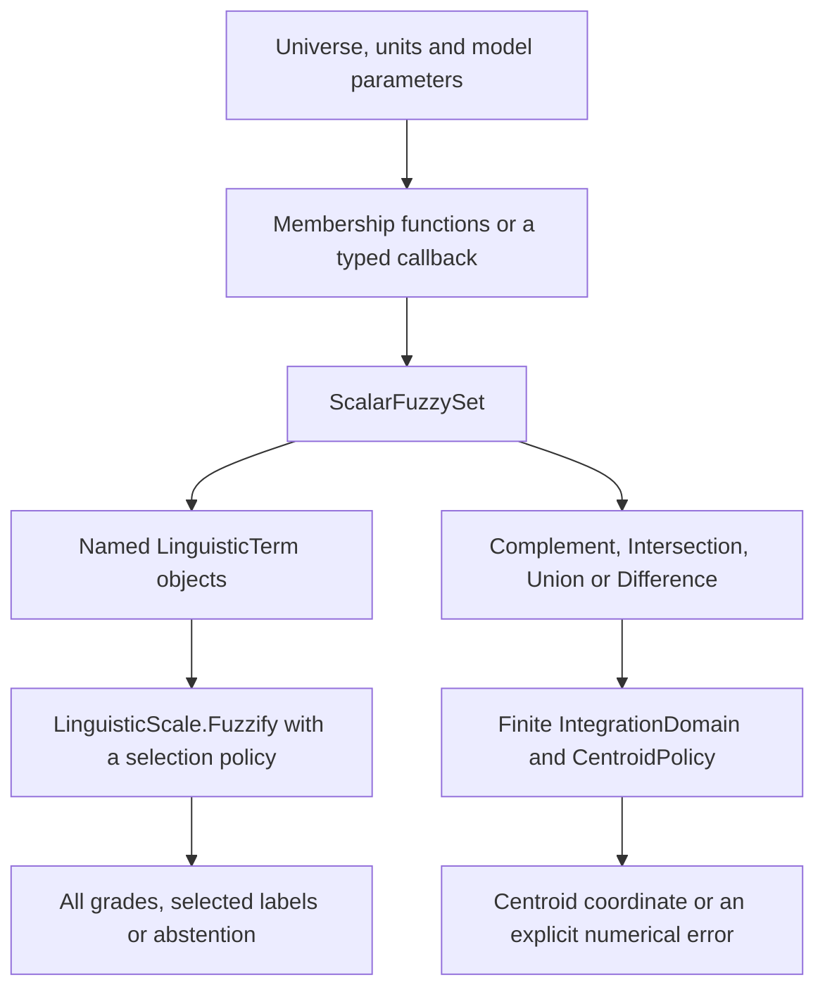
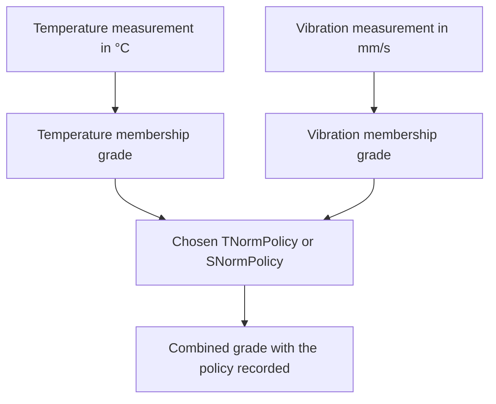
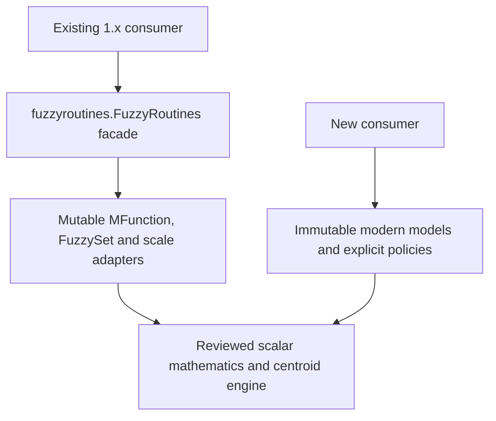

<!--
SPDX-FileCopyrightText: 2026 Timur Gilmullin and Fuzzy Technologies
SPDX-License-Identifier: Apache-2.0
-->

# 从模型到可解释结果 {#from-a-model-to-an-explained-result}

库提供显式的基本构件。先确定物理含义、单位和允许的论域，再选择隶属模型及回答问题的操作。它不会自动创造规则、校准阈值或选择数值后端。

## 现代 API 的两条路径 {#two-routes-through-the-modern-api}

[温度示例](temperature.md)沿分类分支进行：将一个物理测量值对每个命名词项求值。[质心示例](centroid.md)沿组合分支进行：共享论域的集合，在指定有限窗口上产生一个代表性坐标。即使从同一模型开始，它们回答的也是不同问题。

## 在隶属度层面组合独立的传感器测量 {#combine-separate-sensor-measurements-at-the-grade-level}

这就是[传感器场景](sensors.md)。不同物理量保留各自的论域，先求值，再通过显式标量策略组合隶属度。集合层面的交运算则在同一论域的同一坐标上计算多个集合。参见[运算比较](operators.md)。

## 历史接口边界 {#the-historical-boundary}

兼容接口保留已审阅的名称和调用约定，包括可变对象模型、并列时后者胜出，以及用 `supportSet` 表示积分窗口等历史命名。现代对象显式指定论域、选择、比较和积分策略。替换现有调用前应阅读[历史接口示例](historical-recipes.md)：相同的数学意图并不保证参数顺序或并列行为相同。

这些图描述当前的标量 API 路径。可选 NumPy 原型用于实验性工作负载比较，不是自动选择的运行时。使用[结果记录](results.md)保留来源信息，并通过[错误处理](errors.md)区分无效输入与未解决的数学问题。
